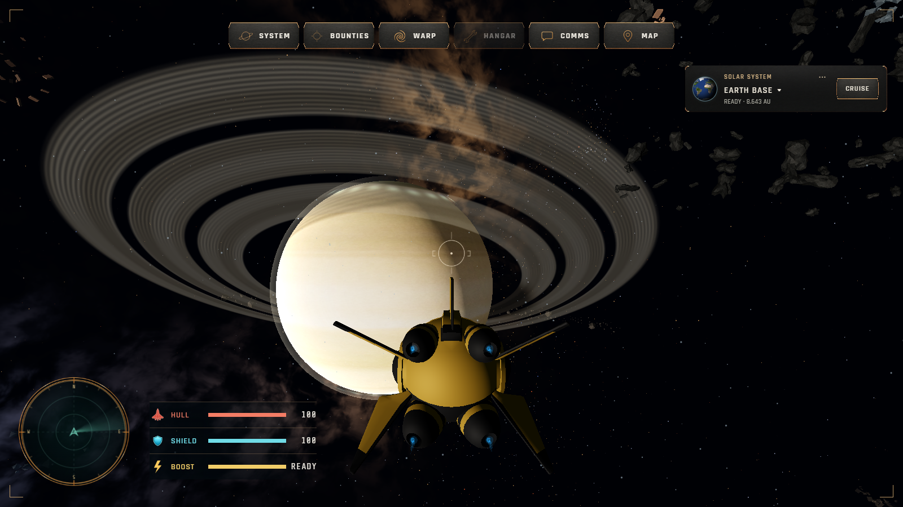
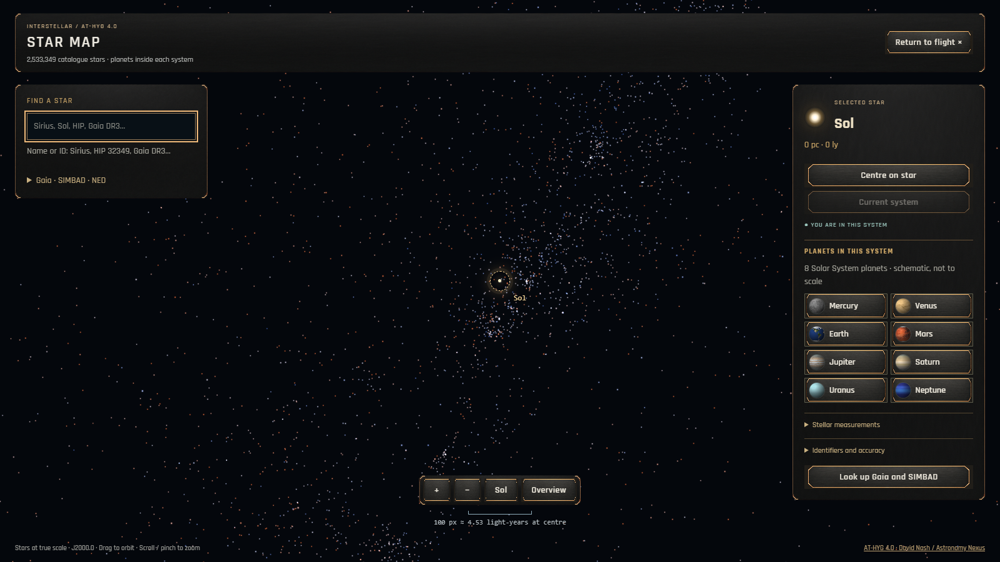
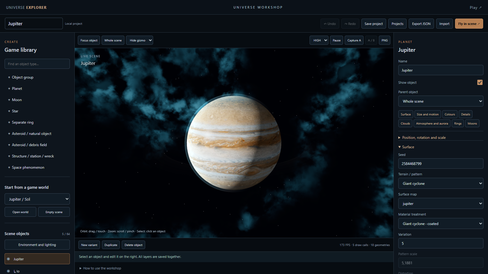

# Universe Explorer

**Explore real star maps. Fly through procedural worlds. Build your own scenes.**

A browser space game built with TypeScript, Vite and Three.js.

[](https://github.com/MooradXO/universe-explorer/actions/workflows/verify.yml)


[Play the game](https://universe.projectai.biz/) · [Workshop guide](docs/WORKSHOP.md) · [Multiplayer](docs/MULTIPLAYER.md) · [Deployment](docs/DEPLOYMENT.md)



[**Getting started**](docs/GETTING_STARTED.md) · [**Documentation**](docs/README.md) · [**Gallery**](docs/GALLERY.md) · [**Architecture**](docs/ARCHITECTURE.md) · [**Roadmap**](docs/ROADMAP.md)

| Fly | Explore | Create |
| --- | --- | --- |
| Cruise, warp, combat and two-thumb controls | A streamed AT-HYG map and distinct planetary environments | A 17-type scene workshop using game renderers |

## Current features

- Flight in the Solar System and travel to catalogue stars, with cruise navigation, warp transitions, first/third-person cameras and a floating origin.
- Lasers, spread shots, missiles, shields, damage, respawn and server-controlled bots.
- One shared Colyseus universe. The production admission limit is **50 concurrent players**; the implementation's local test ceiling of 100 is not a production capacity guarantee.
- Guest sessions, authoritative movement and combat, global text chat and proximity voice signalling. Voice audio travels directly between browsers using WebRTC.
- Titan & Copper HUD, star map, navigation, hangar and manual. Desktop panels open one at a time.
- Compact mobile HUD and two-thumb controls: the left stick combines thrust and steering, while the right thumb holds FIRE. Mobile flight requires landscape orientation.
- Eight Solar System planets, illustrated surfaces, atmospheres, clouds, rings, moons, auroras, structures, debris and phenomena.
- Deterministic procedural worlds with separate physics, appearance and survey versions; worker-generated detail maps, bounded caches and HIGH/LOW quality budgets.
- Local exploration journal and generated survey sites. Generated planets and sites are fictional game content, not confirmed astronomical discoveries.
- A scene workshop at `/environments.html`: 17 object types, editable layers and transforms, parenting, undo/redo, project storage, full-scene JSON and a separate local flight preview.
- An AT-HYG star map with streamed tiles and search, plus explicit on-demand Gaia DR3, SIMBAD and NED lookups.
- Original procedural ambient and weapon audio. An external ambient stream is optional and requires embedding permission.

The current start screen still uses guest ENGAGE. A redesigned hangar, three selectable small ships, three large ships and separate exploration/PvP modes are proposed follow-up work, not features of this release.

## Requirements and quick start

Use Node.js **24.19 or later**. Catalogue tools require built-in SQLite, TypeScript execution and system certificate support.

```sh
git clone https://github.com/MooradXO/universe-explorer.git
cd universe-explorer
npm ci
npm run dev
```

Open the URL printed by Vite (normally http://localhost:3000/). Without multiplayer configuration, flight runs locally. Full catalogue search and map tiles require the separately prepared data described in [CATALOG_PIPELINE.md](docs/CATALOG_PIPELINE.md); those databases are not included in Git.

```sh
npm run build
npm run preview -- --port 3000
npm test
npm run multiplayer:check
```

On the original Windows workspace, `scripts/run.ps1` can use the adjacent portable npm installation when npm is absent from PATH.

## Multiplayer development

```sh
npm run multiplayer:build
npm run multiplayer:dev
# In another terminal:
npm run multiplayer:preview
```

The separate client preview uses http://127.0.0.1:3012/ and connects to ws://127.0.0.1:2567. It does not overwrite the main `dist/`.

`VITE_MULTIPLAYER_URL` selects the authoritative backend. An unavailable configured backend produces a connection error; the game does not silently become offline multiplayer. The old Supabase transport is opt-in through `VITE_LEGACY_REALTIME=true` and is never used when a Colyseus URL is set. See [.env.example](.env.example); never publish local environment files.

## Workshop

Open `/environments.html` on a local development or preview server. Start with an existing world or a blank scene, add objects, edit their parameters, save a project and export JSON. The workshop uses the game's rendering components. Its flight preview is local: it does not publish a scene to the shared server or include the server's combat, bots and economy. See [WORKSHOP.md](docs/WORKSHOP.md) for controls, libraries and limits.

## A closer look

| Star map | Universe workshop |
| --- | --- |
|  |  |
| Streamed stars, search and system selection | Layers, parenting, projects and local preview flight |

[Open the full-size gallery](docs/GALLERY.md).

## Controls

| Input | Action |
| --- | --- |
| W / S | Forward / reverse thrust |
| A / D | Strafe and combat roll |
| Q / E | Roll |
| Space / Ctrl | Vertical strafe |
| Shift | Boost |
| Mouse / right mouse button | Steering / free look |
| Left mouse button | Fire |
| 1 / 2 / 3 | Select weapon |
| C | Laser colour |
| V | Camera |
| T | Voice mute |

## Architecture

- `src/core/Engine.ts`: rendering, cameras and frame loop.
- `src/core/ShipController.ts`: input and flight state.
- `src/world/WorldBuilder.ts`: world, combat, HUD and network orchestration.
- `src/world/CombatSystem.ts`: projectile presentation and offline combat.
- `server/`: authoritative Colyseus room, simulation, guest storage and admission.
- `src/network/shared/`: protocol, snapshot encoding and shared flight mathematics.
- `src/world/generation/`: versioned world data, detail jobs and scene documents/composition.
- `src/world/environments/`: deterministic environment libraries and rendering resources.
- `src/catalog/`, `scripts/catalog/`: catalogue adapters, map tiles, search and provenance.
- `src/tools/environment-review/`: workshop UI and local flight preview.
- `src/world/ShipVisualConfig.ts`: model orientation, engine nozzles and muzzle placement.
- `tests/`: unit and browser regression coverage.

## Deployment and verification

A full installation needs the static client, catalogue API/data and multiplayer service. Copying only `dist/` does not provide the complete online game. [Deployment instructions](docs/DEPLOYMENT.md) describe isolated releases, persistent data and rollback.

[DEBUG_API.md](docs/DEBUG_API.md) documents test fixtures. [CHANGELOG.md](CHANGELOG.md) records the current changes; [ROADMAP.md](docs/ROADMAP.md) separates completed work from proposals. Historical reports describe the build tested on their stated date. Old constellation artwork was subsequently removed.

## Licensing

Code: [MIT](LICENSE), copyright MooradXO. Ship/station models: [CC BY 4.0](public/models/LICENSES.md), supplied by MooradXO as paid-plan Meshy output. Solar System Scope textures, catalogue data and selected EpicToonFX resources have separate terms in [THIRD_PARTY_NOTICES.md](THIRD_PARTY_NOTICES.md); MIT does not override them.

[MooradXO](https://github.com/MooradXO)
