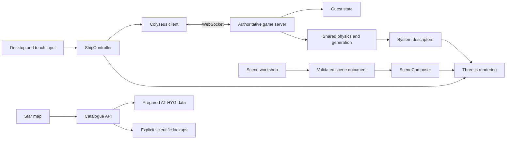

# Architecture

Universe Explorer combines a browser game, an authoritative multiplayer service, a catalogue API and a local scene editor. It is an application with reusable generation/rendering components, not a published general-purpose engine SDK.

## World generation

A fixed seed identifies a world. Physical version 1 keeps orbits, radii, collision fields and save compatibility stable. Appearance and survey versions evolve independently. WorldModel supplies an explicitly fictional climate/composition model for generated planets; known Solar System coordinates remain separate from artistic rendering.

Surface detail jobs bake packed spherical maps in a worker. A bounded cache, cancellation and a time-sliced fallback keep resource use controlled. HIGH/LOW selects budgets. Floating origin maintains local numerical precision during long travel.

## Presentation and editing

CinematicPlanet and environment libraries render the game and workshop. SceneDocument validates object types, parameters, transforms and an acyclic parent graph. SceneComposer creates/disposes the shared rendering components. Editor history, drafts, named projects and exported JSON are distinct from ordinary game saves.

Preview flight reuses ShipController and projectile/impact visuals. It does not invoke the authoritative combat server or turn an edited scene into a published world.

## Multiplayer boundary

The server owns legal movement, health, damage, projectiles, bots, travel and guest state. The client predicts local movement and reconciles acknowledged input; other entities interpolate snapshots. Interest management limits nearby-system traffic.

One shared room is capped at 50 in production. CPU headroom and bandwidth are measured separately. Adding virtual CPUs alone does not remove a sequential simulation bottleneck.

## Catalogue boundary

The browser receives map tiles and object cards, not SQLite. The catalogue service reads prepared AT-HYG data and makes bounded external scientific requests only after a user action. Observations preserve source, units, timestamp and identifiers; absent distances are not invented.

## Main modules

| Area | Source |
| --- | --- |
| Render loop | src/core/Engine.ts |
| Controls and flight | src/core/ShipController.ts, MobileFlightInput.ts |
| Orchestration | src/world/WorldBuilder.ts |
| Combat | src/world/CombatSystem.ts, server/Simulation.ts |
| Network protocol | src/network/shared/ |
| System generation | src/world/systems/, src/world/generation/ |
| Environment recipes | src/world/environments/ |
| Workshop | src/tools/environment-review/ |
| Catalogue | src/catalog/, scripts/catalog/, scripts/server/ |
| HUD/map | src/ui/, src/ui/star-map/ |

[Debugging](DEBUG_API.md) · [Multiplayer](MULTIPLAYER.md) · [Workshop](WORKSHOP.md)
