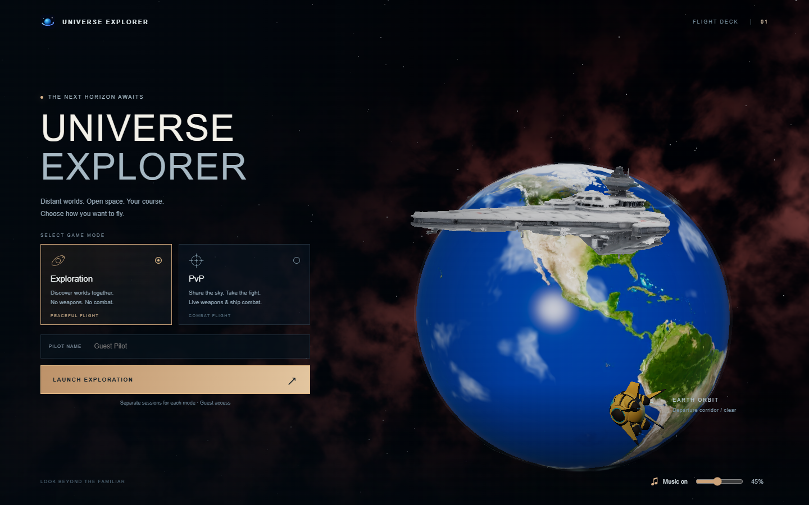

# In-game gallery

Actual screenshots captured from the September 24 build in isolated local browser sessions. These are working game/editor screens, not concept mockups. The English workshop uses the same rendering components as gameplay.

## Orbital launch

Choose a peaceful or combat session, name your pilot and set the ambient music before departure.

## Flight and HUD

Flight, planetary rendering and navigation share the same world data. The desktop HUD keeps the centre available for steering and aiming.

## Catalogue map

The map combines streamed stars, searchable cards and a schematic planet selector. Catalogue distances remain linear.

## Scene workshop

The library, live scene and inspector expose planet layers and the other game content types. Projects can be saved, exported as JSON and opened in a separate local flight preview.

[Workshop guide](WORKSHOP.md) · [Getting started](GETTING_STARTED.md) · [Architecture](ARCHITECTURE.md)
