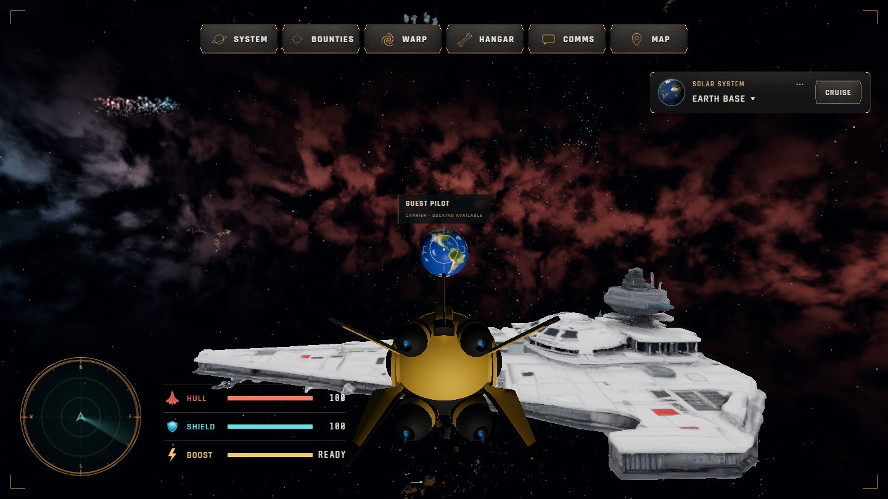
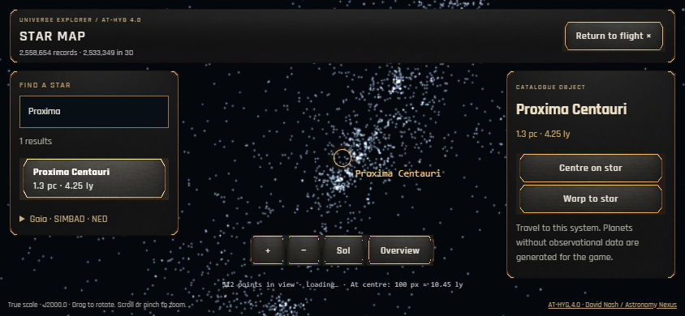

# Обновление сервера — 19 сентября 2026

## Результат

На [universe.projectai.biz](https://universe.projectai.biz/) установлена текущая игра с генератором окружений, HUD Titan & Copper и гостевым входом. Изображения созвездий и их renderer отсутствуют. Игровые механики в этом развёртывании не менялись.

Клиент и сервер подготовлены из `2c339027b4b94ea7dc0fc6d84f8ab8c8d93f50a1`; конфигурация Nginx сохранена в `69b34f051addaab4ebadd598d205911bc79b922b`. Активный release: `20260919-2c33902`. Публичный entry — `main-D-sBjSMf.js`, SHA256 `9bc860688df33ea8e42d8b80aa181f9ac21452a05a18c135bc8f8670df80179b`. Клиент собран с прежними публичными настройками backend игры.

## Что установлено

- Отдельный release в `/var/www/universe-explorer/releases/` и ссылка `current`.
- Подготовленная карта: 2 558 654 записи для поиска, 2 533 349 позиций и 2 622 сжатых блока. Переданы только manifest, search.sqlite и tiles; рабочие научные архивы и повторные импорты не переносились.
- Отдельная служба `universe-catalog.service`, непривилегированный пользователь и Node.js 24.19.0 в `/opt/universe-explorer/runtime/`. Системный Node.js сохранён.
- API доступен через Nginx; сам процесс слушает `127.0.0.1:4312`. Ограничены частота запросов, память службы и кеш внешних источников.
- Изменён только virtual host игры; TLS и redirect сохранены.

## Проверки

- TypeScript, space-only guard, production build и 68 unit tests — PASS. Проверены HTTP-границы отдельного API, включая запрет выдачи SQLite и служебных файлов.
- SHA256 обоих архивов, 248 файлов release и 2 624 файлов каталога после распаковки — PASS. SHA256 отдельного Node.js проверен по официальной поставке.
- `nginx -t`, запуск и автозапуск службы, HTTPS и контрольная сумма публичного entry — PASS.
- Поиск Proxima, карточка и распаковка блока карты — PASS.
- Gaia DR3, SIMBAD и NASA NED отвечают; каждый проверочный запрос вернул одну запись.
- В браузере на живом сайте HIGH 1440×810 и LOW/touch 844×390: ENGAGE → полёт → Flight Manual → Hangar → карта → Proxima Centauri → возврат на базу — PASS. Необработанных JS-ошибок, ответов HTTP ≥400 и запросов изображений созвездий в этих маршрутах нет. [Результаты](live-browser-smoke.json).
- Контрольные суммы остальных 10 конфигураций Nginx совпадают с исходными; HTTP-статусы всех проверенных сайтов и PID двух прежних PM2-процессов сохранены.

Во время проверки обнаружена независимая пересборка одного чужого Docker-контейнера: его ID изменился. Команды изменения Docker в этой работе не выполнялись; остальные контейнеры сохранили ID. Чужие изменения не отменялись.

### Ограничения проверки

Прежний Supabase endpoint не разрешается через DNS с сервера и с локального компьютера. Эта ошибка наблюдалась до переключения сайта. Конфигурация сохранена; оба браузерных маршрута завершились без Realtime-подписки. Гостевой полёт и каталог работают, multiplayer и сетевой чат требуют отдельного восстановления backend.

На холодной загрузке карта может заменить очень ранний выбор результата на текущую систему после завершения начальной загрузки. В итоговой проверке выбор выполнялся после появления карточки текущей системы. Также headless LOW потребовал большего ожидания анимации возврата; отдельная проверка подтвердила завершение перелёта. Код игры ради этих проверок не изменялся.

## Визуальная проверка

## Откат и сохранённые данные

Старая игра осталась в `/var/www/universe_game`. Резервная копия сайта, прежняя конфигурация Nginx и контрольные снимки хранятся в `/var/backups/universe-explorer/2026-09-19/`. Архивы передачи сохранены в отдельной папке `incoming`; автоматическое удаление старых данных не выполнялось.

[Устройство размещения и порядок отката](../../DEPLOYMENT.md). Пароли, приватные ключи и полные JWT не записывались в отчёт или Git. ZIP для другого компьютера и пользовательская вкладка игры не изменялись.
