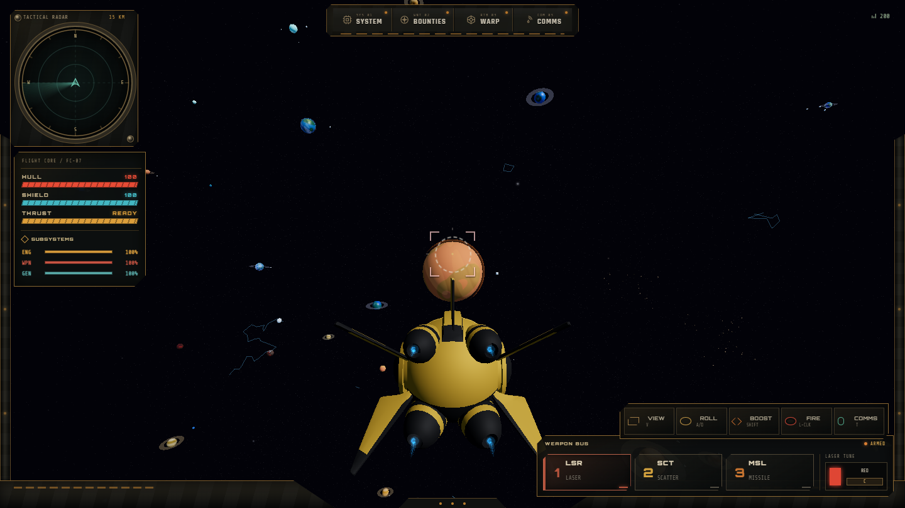
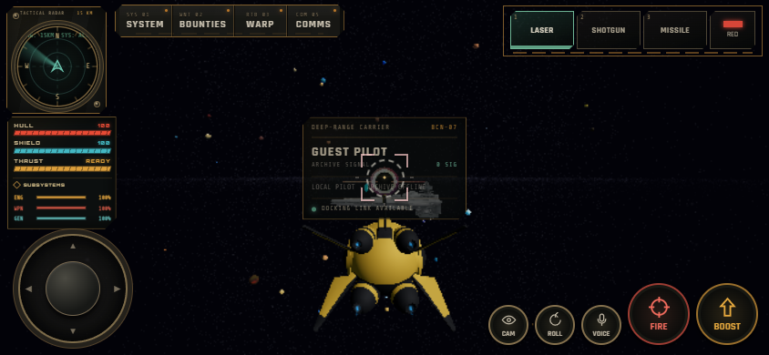

# Первый implementation sprint — space-only

Дата: 2026-09-15. База: `MooradXO/universe-explorer`, commit `99f34cb`.
Рабочий каталог: `E:\UNIVERSE\UNIVERSE2\project\universeproject (2)`.

## Результат

- Стабильный read-only `window.__UNIVERSE_DEBUG__` работает в production и dev. Frame/FPS, renderer counters, JS heap, игроки и счётчики Realtime доступны без доступа к изменяемым engine objects.
- Named guest scenes `near-base` и `planet-showcase` зафиксировали исходное состояние до удаления функции. Baseline использовал будущий v1 seed только в fixture; обычная исходная игра оставалась со случайным seed.
- Чистые types/catalog/seed/palette и orbital textures/rim выделены в шесть модулей `src/world/celestial/`. В каталогах нет Three.js/DOM, clocks, `Math.random()` или ссылок на surface/runtime.
- Все клиенты используют `universe-explorer:world:v1`. 80 позиций, радиусов и seeds совпадают с измеренным fixture до рефакторинга; визуальная палитра использует отдельный поток RNG. Тесты не позволяют незаметно менять layout версии v1.
- Удалены 14 старых planet-модулей, mode/scene transitions, prompts, `F`, legacy `planetSmoke`, surface/terrain/weather/chunks, 81 public planet asset и зависимость `simplex-noise`. Кнопка объекта теперь `CLOSE` и закрывает карточку. Тексты о посадках/гонках удалены из актуального README/UI. Космические shells, clouds, rings и moons сохранены.
- Добавлен `THIRD_PARTY_NOTICES.md`: d3-celestial, copyright Olaf Frohn, BSD-3-Clause, source mapping. Vite включает notice в `dist` из одного исходного файла.
- `check:space` встроен в build; Vitest, Playwright и относительный performance comparator доступны для следующих спринтов.

Удалённые пользовательские файлы сохранены вне production в `E:\UNIVERSE\UNIVERSE2\user_files\retired-planet-runtime-2026-09-15`. Начальная временная копия с D перенесена целиком в `user_files/development-copy-before-transfer-2026-09-15`; проект на D отсутствует. Архивные docs о старой функции остаются историей.

## Окружение и проверки

- Node.js 24.19.0, локальный npm 12.0.2, Vite 8.2.0, Three.js 0.160.1.
- `npm ci` выполнен на E; npm в PATH отсутствовал, portable npm сохранён в соседней `project/.tools/`.
- `scripts/run.ps1` запускает npm-задачи как через установленный npm, так и через локальный runtime; восстанавливает PATH после запуска.
- `npm run build`: PASS, 115 modules, без chunk warnings.
- `npm test`: PASS, 8 тестов (каталог, независимость от времени/RNG, эталон координат, frame timing, counters, сетевой throttle и distance filtering).
- До удаления: 4/4 Playwright tests PASS.
- После: 6/6 PASS. Desktop 1440×810 HIGH, Android/touch landscape 844×390 LOW. Guest start/back/focus/entry, камера, оружие, движение, наличие планет, отсутствие старых controls; два независимых контекста дают одинаковые descriptors и palettes без общей storage/RNG.
- Console warnings/errors в named scenes: 0, page errors: 0.
- `node scripts/compare-space-smoke.mjs`: PASS, допуск 5% к FPS/frame/calls/triangles при одинаковом renderer profile.
- `npm audit`: 0 уязвимостей.
- `git diff --check`: PASS.
- Production preview запущен на `http://127.0.0.1:3000/` из E.

## Bundle

| Показатель | Исходная игра | С debug перед удалением | Space-only |
| --- | ---: | ---: | ---: |
| App JS raw | 248.98 kB | 252.93 kB | 212.96 kB |
| App JS gzip | 72.74 kB | 74.12 kB | 62.77 kB |
| CSS raw | 69.75 kB | 69.75 kB | 65.66 kB |
| CSS gzip | 14.94 kB | 14.94 kB | 14.20 kB |
| Three shared raw | 562.15 kB | 562.15 kB | 561.63 kB |

App raw уменьшился на 14.5% относительно исходной игры, несмотря на добавленные diagnostics. Удалено 600 496 bytes public assets.

## Renderer baseline → after

Edge headless, один worker. После прогрева 6 s снято восемь snapshots с интервалом 1 s. Pixel ratio: desktop 1, mobile 0.75; разрешение renderer совпадает в парных замерах. До/после фиксировалась декоративная случайность и положение гостя. Значения FPS относятся к этому тестовому окружению, не означают 200 FPS на реальном телефоне и не сравниваются с прежним интерактивным 60 FPS baseline.

| Сцена | FPS avg | Frame ms avg | Calls min–max | Triangles min–max | Geometries | Textures |
| --- | ---: | ---: | ---: | ---: | ---: | ---: |
| desktop-high-near-base | 200.00 → 200.00 | 5.00 → 5.00 | 140 → 140 | 114848 → 114848 | 58 → 58 | 100 → 100 |
| desktop-high-planet-showcase | 200.00 → 200.00 | 5.00 → 5.00 | 150–152 → 150–152 | 82697–82921 → 82697–82921 | 42 → 42 | 105 → 98 |
| mobile-low-near-base | 200.01 → 199.98 | 5.00 → 5.00 | 97 → 97 | 87264 → 87264 | 41 → 42 | 78 → 95 |
| mobile-low-planet-showcase | 200.01 → 200.00 | 5.00 → 5.00 | 89 → 89 | 42495 → 42495 | 32 → 32 | 75 → 75 |

Calls/triangles и frame time не ухудшились. Небольшие различия textures/geometries зависят от момента GPU-upload лениво используемых материалов/моделей. Эти счётчики теперь наблюдаемы; GPU bytes WebGL не предоставляет и API возвращает `null`. JS heap сохраняется во всех JSON и колеблется из-за GC; эти snapshots не доказывают отсутствие утечек и не используются как строгий byte budget.

## Evidence и повторение

- [API и команды](../../DEBUG_API.md).
- `before/*.json`, `after/*.json` — полные снимки и descriptors.
- `before/*.png`, `after/*.png` — четыре ракурса до/после.
- `tests/fixtures/planet-layout-v1.json` — эталон из baseline.
- После нового build: `./scripts/run.ps1 test:smoke`, затем `node scripts/compare-space-smoke.mjs`.

## Границы спринта и следующий шаг

Секторный streaming и floating origin ещё не реализованы; текущий мир остаётся конечным. Постоянный seed введён для каталога планет. Legacy декоративный cosmos, comet/cinematic randomness и единое время движущихся объектов будут переведены на секторный seed contract в следующем спринте. Реальный Supabase backend не настроен: smoke был offline guest; доставка через сеть и GitHub OAuth не проверялись. Схема payloads и auth не менялись.

Следующий пункт: pure sector coordinates/manifests + boundary tests, затем floating-origin recenter с сохранением flight/combat.

## Библиотека пользовательских эффектов

Источник: `C:\Users\pc\Documents\Codex\2026-09-07\pro\outputs\EpicToonFX-ThreeJS`.
Пользователь сообщил, что пакет приобретён и адаптирован им для Three.js, и разрешил применять подходящие эффекты. README: 1 326 presets, lazy asset loading, lifecycle `create/update/stop/dispose`, WebGLRenderer. Проверенная библиотекой Three.js версия 0.185.1; в игре 0.160.1. Перед выбранной интеграцией проверить совместимость на отдельном smoke и подключать эффект адаптером к текущим EffectsManager/CombatSystem, с `groundY: null`, лимитами частиц и HIGH/LOW budgets. В этом спринте новых VFX не требовалось; библиотека не добавлена в игровой bundle. Авторство/лицензионные сведения пакета сохраняются отдельно от MIT-кода игры.
