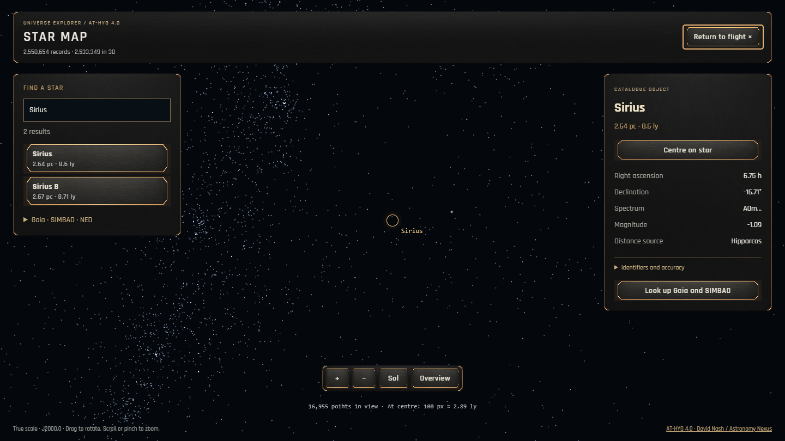
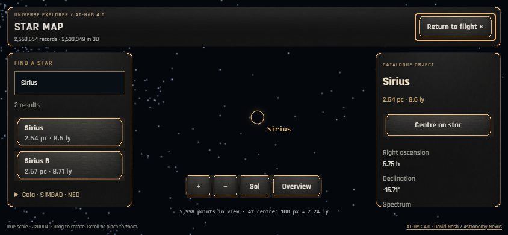

# Спринт 3D-карты AT-HYG — 15 сентября 2026

## Результат

В игре появилась кнопка **КАРТА**: вращение, приближение, поиск по всему AT-HYG 4.0, выбор точки и карточка звезды. Пользователь выбрал оформление текущего HUD с медными акцентами, реальные пропорции расстояний и поиск/карточки без 3D-точки для неизвестной дистанции. Реализованы именно эти варианты.

Работа и данные находятся на E. Preview: `http://127.0.0.1:3000/`, обычный guest entry. Данные подключаются через локальный Vite middleware и не включены в repository/public/dist. Запросы ESA и публикация не выполнялись. Дополнительные Gaia DR3/SIMBAD/NED, реальные подробные системы и варп к выбранной звезде остаются следующими этапами; текущий полётный мир не перенесён в астрономические координаты.

## Полнота и точность

| Показатель | Проверенный результат |
| --- | ---: |
| Записи поиска / карточки | 2 558 654 |
| Позиции в 3D | 2 533 349 |
| Без известной 3D-позиции | 25 305 |
| Блоки карты | 2 622 |
| Суммарный gzip блоков | 57 310 346 bytes |
| Manifest | 442 711 bytes |
| Локальный search.sqlite | 1 486 831 616 bytes |
| Максимум звёзд в конечном блоке | 4 079 |
| Пропуски / повторы между конечными блоками | 0 / 0 |

`verify-map.mjs` независимо сопоставил все ID/XYZ конечных блоков с подготовленной исходной базой; также проверены выборки родителей, суммы count дочерних узлов и численная точность каждой координаты. Gaia ID в карточках остаются строками. Компоненты с общим Gaia ID показываются отдельно и сопровождаются пояснением; слепого слияния нет.

Координаты блоков хранятся как Float32 относительно своего центра; максимум измеренного округления одной оси в конечных блоках — 0.0149000000674 pc у далёких объектов. Исходные координаты в карточке/API сохранены как Number/Float64 и используются для центрирования. Это оценка численного округления формата отображения, а не научной точности наблюдений. Погрешности/эпоха измерения отсутствуют в AT-HYG; интерфейс это указывает. Равноденствие J2000.0 не подменяет эпоху. Размер и цвет точек условные.

Общий обзор включает редкие записи с очень большими исходными расстояниями; основная масса звёзд поэтому выглядит компактно. Для изучения окрестностей есть приближение, поиск и кнопка Солнце. Это полный выбранный звёздный каталог, не описание всей Вселенной.

## Архитектура и ограничения ресурсов

- `scripts/catalog/export-map.mjs`, `star-tiles.mjs`, `map-server.mjs`, `verify-map.mjs`: подготовка, индекс, локальный API и проверка.
- `src/catalog/StarMapData.ts`, `StarMapClient.ts`, `StarMapLod.ts`: формат/декодирование, запросы, выбор детализации и ограниченный cache.
- `src/world/star-map/StarMapView.ts`: отдельная Three.js сцена, камера, OrbitControls, GPU points и выбор звезды.
- `src/ui/star-map/`: диалог, поиск, карточки, состояния ошибки/повтора и responsive CSS.
- `Engine`: один существующий WebGLRenderer и render loop. Ввод корабля блокируется отдельной причиной в ShipController; WorldBuilder проверяет блокировку стрельбы/выбора объектов. Симуляция продолжается. При смерти/выходе карта закрывается.

| Бюджет | HIGH | LOW |
| --- | ---: | ---: |
| Активные блоки / draw calls карты | ≤32 | ≤20 |
| Точки активного слоя | ≤90 000 | ≤45 000 |
| Блоки в кеше | ≤80 | ≤48 |
| Одновременные загрузки | ≤2 | ≤2 |

Новый набор блоков сменяет предыдущий после полной загрузки. Закрытие отменяет запросы, снимает listeners, освобождает геометрии/материал; второй WebGL context не создаётся. Число GPU geometries до/после close/reopen: HIGH **71 → 71**, LOW **57 → 57**; textures: HIGH **14 → 14**, LOW **11 → 11**.

Основной app chunk: 225.30 KB / 66.80 KB gzip. Карта подгружается отдельно: 18.66 KB / 7.29 KB gzip JS, 5.09 KB / 1.64 KB gzip CSS. До открытия карты запросов каталога нет. Слои других каталогов в память не загружаются.

## Проверки

- Build, TypeScript, space-only guard — PASS.
- 33 unit tests — PASS: import/ID/CSV, экспорт/декодирование блоков, совпадающие позиции, LOD budgets, отмена/закрытие загрузок, поиск/SQL binding и локальные read-only endpoints.
- 14 Playwright tests — PASS на Edge: HIGH 1440×810 и LOW mobile 844×390. Карта: поиск Sirius/Sol, точка через реальный pointer click, колесо и touch pinch, поворот, точные длинные Gaia ID, неоднозначные компоненты, отсутствие дистанции, Escape/focus, блокировка полёта/стрельбы, отсутствие утечек при close/reopen, недоступный каталог/retry и закрытие во время запроса.
- Полётные near-base/showcase, guest, boundary с ботами/выстрелами, ReturnToBase и дальний sector-tour — PASS.
- Сравнение с предыдущей секторной сборкой: относительный бюджет 5% PASS. Near-base calls HIGH 104 → 104, LOW 85 → 85; triangles HIGH 61 848 → 61 848, LOW 58 416 → 58 416. Headless frame timing не характеризует реальные телефоны.
- HIGH/LOW screenshots просмотрены. Мобильные flight controls скрываются на время карты; после закрытия возвращаются.

Evidence: [экспорт](export-report.json), [проверка всех блоков](verification.json), `desktop-high-map.json`, `mobile-low-map.json`, `flight/` и `sectors/`. Инструкции воспроизведения и API — [CATALOG_PIPELINE](../../CATALOG_PIPELINE.md).

