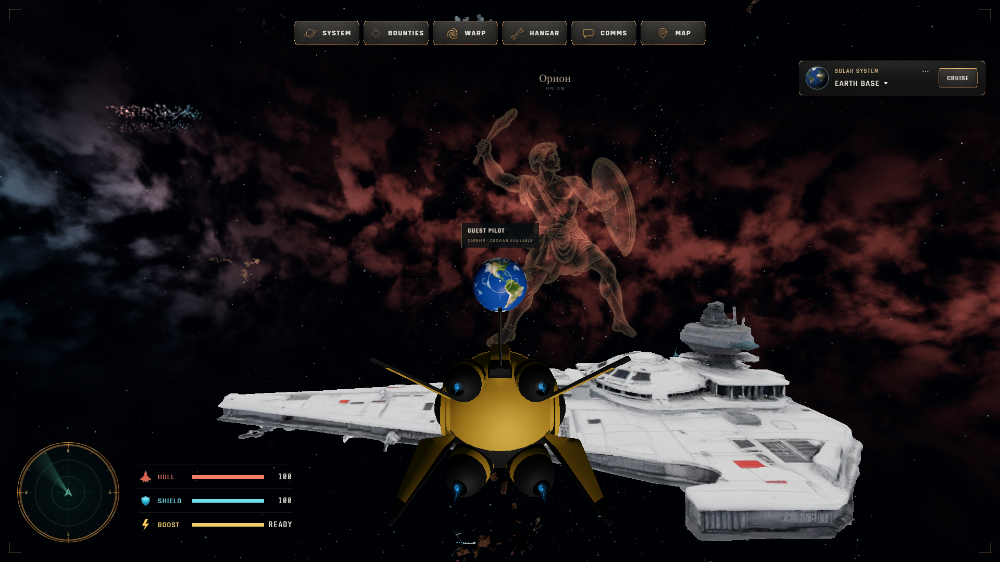
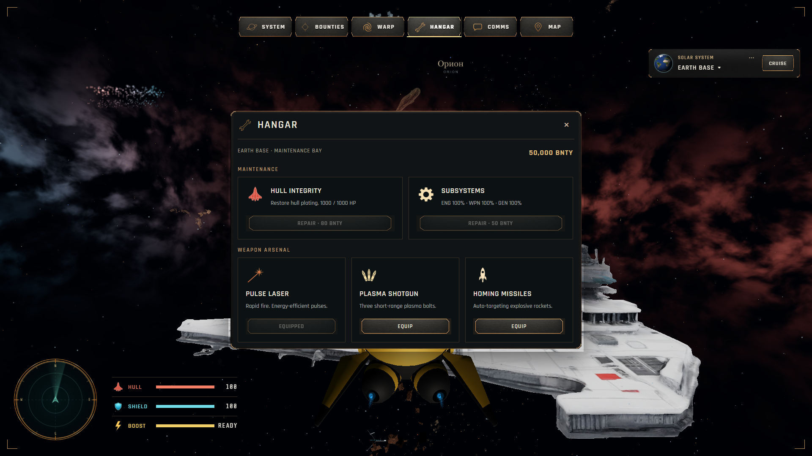

# HUD Titan & Copper — установлен 18.09.2026

Пользователь утвердил полноэкранные макеты и потребовал исключить наложение открываемых меню. Изменена основная игра на http://127.0.0.1:3001/. Entry: `main-ChoRyZbd.js`, SHA256: `46430b0e49c8df3ec15c48d2a7c3c9e9058ffa1eeafb2c5f1afb79016b697ce3`.

## Результат

- Верхний ряд SYSTEM / BOUNTIES / WARP / HANGAR / COMMS / MAP выровнен. HANGAR сохраняет место, вне базы недоступен.
- Полёт на весь экран; небольшие угловые отметки, круглый живой радар слева снизу, HULL / SHIELD / BOOST справа от него, компактное назначение и CRUISE справа сверху.
- Убраны постоянные настольные кнопки оружия/камеры/манёвров, тяжёлые края кокпита, FPS и старые архивные поля подписи базы. Горячие клавиши и отдельное touch-управление сохранены.
- `HudPanels` управляет System, Manual, Bounties, Comms, Hangar, Flight details, списком назначения, информацией об объекте и ленивой native-картой. Одно окно за раз, закрытие X/Escape/повторной кнопкой. Отмена запоздалого открытия карты при переходе к другому окну.
- Flight Manual — самостоятельное окно, правильные клавиши взяты из ShipController. Ввод в окне блокирует управление кораблём, закрытие возвращает фокус и управление.
- Wanted Board / Comms справа, Hangar / Manual по центру. На небольшом экране прокручивается содержимое; заголовок и закрытие доступны.
- Переведены карта, навигация, солнечные названия и служебные UI-сообщения. Каталожные ID, координаты, масштабы, цена ремонта/оружия и игровые правила сохранены.
- Новых игровых механик и зависимостей нет. Новые каналы чата не добавлены. Стартовое меню, ZIP и Git не менялись.

## Графика

18 оригинальных RGBA PNG: 14 иконок, основа кнопки, рамка окна, обод радара, прицел. Общий объём 7 480 087 байт. Все копии побайтово совпадают с оригиналами ImageGen. Изображения не редактировались программно; размеры/рамки адаптируются CSS во время отображения. Текст, заполнение шкал и контакты радара остаются динамическими.

- [Промпты](../../art-direction/hud-redesign-2026-09-18/production-prompts.json).
- [Оригиналы](../../art-direction/hud-redesign-2026-09-18/production-sources.json).
- [Проверка SHA256 / alpha / размеров](../../art-direction/hud-redesign-2026-09-18/production-audit.json).
- [Все состояния на трёх экранах](../../art-direction/hud-redesign-2026-09-18/implementation/layout-report.json).

## Проверки

- TypeScript, space-only guard, Vite production build — PASS.
- 78 unit tests / 21 files — PASS.
- 6 новых браузерных сценариев HIGH/LOW: взаимное исключение окон, границы и пересечения с навигацией, ввод, возврат камеры, экипировка существующего оружия, закрытие, отмена загрузки карты, загрузка графики и выравнивание — PASS.
- 2 существующие проверки списка назначения с клавиатурой/касанием и поворотом устройства — PASS.
- 4 сценария карты и 4 сценария дополнительных источников — PASS. Старое ожидание `0,8 Mpc` исправлено на `0.8 Mpc` для английской локали; числовое значение не менялось.
- Сняты 24 состояния на 1920×1080 HIGH, 1366×768 LOW и 844×390 LOW touch. Ошибок JavaScript и отсутствующих изображений нет.
- После установки: 2 отдельных guest smoke на HIGH/LOW основной страницы — PASS; [результат](installed-smoke.json).
- Длинные маршруты stellar-flight/cinematic-flight в этой задаче повторно не запускались; их селекторы обновлены под английские подписи и окно Flight details. Тестовых сообщений другим игрокам не отправляли.

## Установка

[Installation manifest](installation.json). Старый entry и все старые hashed assets сохранены, новые зависимости скопированы перед index.html. Пользовательская вкладка не перезагружалась.

